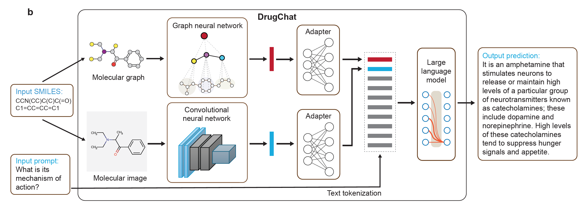

# DrugChat: Multi-Modal Large Language Model Enables All-Purpose Prediction of Drug Mechanisms and Properties

This repository holds the code of DrugChat. Read the biorxiv [preprint](https://www.biorxiv.org/content/10.1101/2024.09.29.615524).


## Introduction
- In this work, we make an initial attempt towards enabling ChatGPT-like capabilities on drug molecule graphs, by developing a prototype system DrugChat.
- DrugChat works in a similar way as ChatGPT. Users upload a compound molecule graph and ask various questions about this compound. DrugChat will answer these questions in a multi-turn, interactive manner. 
- The DrugChat system consists of a graph neural network (GNN), a convolutional neural network (i.e., ResNet), a large language model (LLM), and an adaptor. The GNN takes a compound molecule graph as input and learns a representation for this graph. The adaptor transforms the graph/image representation produced by the GNN/CNN into another representation that is acceptable to the LLM. The LLM takes the compound representation transformed by the adaptor and users' questions about this compound as inputs and generates answers. All these components are trained end-to-end.
- To train DrugChat, we collected instruction tuning datasets.



## Datasets

Please download the data json files from the [Hugging Face](https://huggingface.co/datasets/youweiliang/drugchat). The structure of each dataset is described in [scalable_data_format.md](scalable_data_format.md).


## System Requirements
The DrugChat was tested on Ubuntu 20.04 with an Nvidia A100 80G GPU (Nvidia driver version: 560.35.03). Other Linux systems and GPUs (with more than 40 GB GPU memory) should also work. The Python environment was based on [Miniconda](https://docs.anaconda.com/miniconda/miniconda-install/) 23.1.0. You can install the latest Nvidia driver and the latest Minicond, as they should not make any difference. The complete list of software requirements is specified in [environment.yml](environment.yml).


## Installation

Typical install time on an Linux server is 10 minutes, depending on your Internet connection speed.

### Setting up environment

[Install Git](https://git-scm.com/downloads) if it has not been installed. 
Git clone our repository, creating a python environment and ativate it via the following command

```bash
git clone https://github.com/youweiliang/drugchat
cd drugchat
conda env create -f environment.yml
conda activate drugchat
```

Verify the installation of `torch` and `torchvision` is successful by running `python -c "import torchvision; print(torchvision.__version__)"`. If it outputs the version number without any warnings or errors, then you can go to the next step (installing PyTorch Geometric). __If it outputs any warnings or errors__, try to uninstall `torch` by `conda uninstall pytorch torchvision torchaudio cudatoolkit` and then reinstall them following [here](https://pytorch.org/get-started/previous-versions/#v1121). You need to find the correct command according to the CUDA version your GPU driver supports (check `nvidia-smi`). For example, I found my GPU driver supported CUDA 11.6, so I run `conda install pytorch==1.12.1 torchvision==0.13.1 torchaudio==0.12.1 cudatoolkit=11.6 -c pytorch -c conda-forge`.

#### Installing PyTorch Geometric
Run `conda install pyg=2.3.0 pytorch-scatter=2.1.0 -c pyg` to install PyTorch Geometric. If some error related to PyTorch Geometric or pytorch-scatter show up later when running the code, try to follow [here](https://pytorch-geometric.readthedocs.io/en/latest/install/installation.html) to reinstall them. 


### Preparing pretrained weights

#### Vicuna
The current version of DrugChat is built on the v0 versoin of Vicuna-13B.
Please refer to our instruction [here](PrepareVicuna.md) 
to prepare the Vicuna weights.
The final weights would be in a single folder in a structure similar to the following:

```
vicuna_weights
├── config.json
├── generation_config.json
├── pytorch_model.bin.index.json
├── pytorch_model-00001-of-00003.bin
...   
```

Then, set the path to the vicuna weight in the model config file 
[here](pipeline/configs/models/drugchat.yaml#L16) at Line 16.


#### GIN and ResNet
Download the GIN and ResNet checkpoints from the [Google drive](https://drive.google.com/drive/folders/1DlLzYf7MHHdA09l5Cv3H5KUULmtazwo1?usp=sharing) and save them in a folder named `ckpt` under this repo. The files would be like
```
ckpt
├── gin_contextpred.pth
├── ImageMol.pth.tar
```


## Training
**The training process needs at least 40 GB GPU memory.** 

Download the datasets and set the dataset path in [train_configs/drugchat.yaml](train_configs/drugchat.yaml), which is the training configuration file. The config file includes the examples of the FS-Mol and ChEMBL datasets. You may want to change the number of epochs and other hyper-parameters there, such as `max_epoch`, `init_lr`, `min_lr`,`warmup_steps`, `batch_size_train`. 

Start training the DrugChat model by running:
```
torchrun --nproc_per_node 1 train.py --cfg-path train_configs/drugchat.yaml
```

The evaluation results (including AUROC and AUPRC) will be save to the file specified by `generate_prob` in the config file.


## Demo

**It takes around 24 GB GPU memory for the demo to work.**

Find the checkpoint ('.pth' files) the training process saves, which is the `output_dir` specified in the training configuration [train_configs/drugchat.yaml](train_configs/drugchat.yaml) by default. Specify the checkpoint path in the `ckpt` field under the model section in the evaluation configuration file [eval_configs/drugbank.yaml](eval_configs/drugbank.yaml).


Run `bash demo.sh` to start the demo. Then, open the URL created by the demo and try it out! This should open the demo website, where you can input a SMILES string and a textual question to ask DrugChat. It could take one minute for Drugchat to generate a response and show it on the demo website, depending on your GPU's computational power and the response's length.


## Acknowledgement
This repo is based on the following repositories.
+ [MiniGPT-4](https://minigpt-4.github.io/)
+ [Lavis](https://github.com/salesforce/LAVIS)
+ [Vicuna](https://github.com/lm-sys/FastChat)
+ [ImageMol](https://github.com/HongxinXiang/ImageMol)
+ [Snap-stanford-gnn](https://github.com/snap-stanford/pretrain-gnns/)


## License
This repository is under [BSD 3-Clause License](LICENSE.md).
Many codes are based on [MiniGPT-4](https://github.com/Vision-CAIR/MiniGPT-4) with BSD 3-Clause License [here](LICENSE_MiniGPT4.md), which is based on [Lavis](https://github.com/salesforce/LAVIS) with BSD 3-Clause License [here](LICENSE_Lavis.md).


## Disclaimer

This is a prototype system that has not been systematically and comprehensively validated by pharmaceutical experts yet. Please use with caution. 

Trained models will be released after we thoroughly validate the system with pharmaceutical experts.
